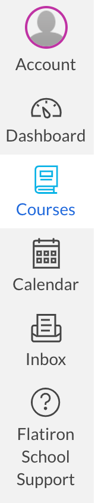
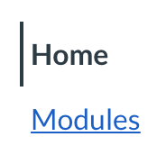
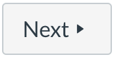
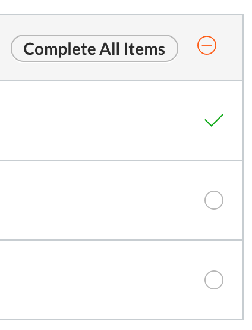

# Welcome

## Introduction

Welcome to Flatiron School's Software Engineering course! Over the next 800-1000
hours you will learn everything you need to know to get started as a Software
Engineer. It's going to be harder, and more rewarding than any other learning
experience you've ever had, we promise, but we're thrilled that you've joined
our community. Let's learn together.

Before diving in, we need to briefly go over a few things. In the next few
lessons, we'll introduce some of the features of this learning platform and get
your personal computer set up for the rest of the course (what we refer to as
_'your local environment'_).

In this lesson, though, we'd like about Flatiron School's philosophy and the
structure of this course.

## Flatiron School's Philosophy

We are comrades in a never-ending quest for knowledge. While there are no
shortcuts, we believe that by providing knowledge in an optimized order,
reinforcing knowledge with hands-on, feedback driven practice, and providing
space for discussion, you will learn quickly. Our goal is to provide the
right materials, support and structure _you_ need to discover your own love for
the code.

## The Learn Community

We don't believe in learning alone. As you make progress, expect to bump into
other learners just like you, ready and willing to help each other succeed.
Together, we can go further than we could ever go alone. We expect everyone to
be friendly, respectful, helpful, and nice.

If you get stuck following the instructions, ask! If you get stuck getting a
coding concept, ask! Instructors and peers from the community will be glad to
help. Equally, if you find someone asking a question that you can provide
insight on, please do! One of the best ways to confirm your own understanding of
a concept is to try and help someone else understand it.

## Accessing Course Content

In Canvas, our Software Engineering curriculum is divided into a series of
_courses_. Each course is a collection of many lessons, organized into topics
(referred to as _modules_ in Canvas).

You can access the courses available to you by clicking **Course** in the
navigation on the left.

Clicking on a course will display that course's home page. In this welcome
course, _this_ lesson is set as the home page.

To access the rest of this course's content, click **Modules** in the navigation
just to the left of this reading.

The **Modules** page displays all course content available to you. Note that
depending on which type of course you're taking, some content may only be made
available _after_ you've completed the current course materials.

## How Our Curriculum Works

As mentioned, lessons are organized into modules based on topic. Later lessons
build off the earlier ones, so it is strongly advised that you complete each
lesson in the order provided. Use the **Modules** page to go back and review
earlier content if needed. When you complete a lesson, use the **Next** button
to continue to the next lesson.

As you work through the content, you'll be able to see which lessons and modules
you've completed, started, and not started.

A check mark indicates you've completed that lesson. An open circle indicates a
lesson you have not started yet. A circle with a dash inside indicates a lesson
you've started, but haven't completed yet.

### Lesson Types

There are a few types of lessons in Canvas. The most basic is a **Page**, like
this lesson. Here are the main lesson types:

- Pages: These contain content to read on a particular subject. No action
  needed, just reading and learning.
- Assignments: These are lessons where action _is_ needed. Assignments can be
  many things. Some assignments will include tests for code, sometimes refered
  to as _labs_. Other assignments may just ask you to code along and apply a
  concept as you are learning it.
- Quizzes: These are included to assess your knowledge of the topics discussed.
  Quizzes will typically be placed at the end of a topic.

Portfolio projects, assessments and blog submissions will all be available in
Canvas as assignments, since they all require work to be submitted. We will
talk more about assignments in the next lesson.

## Conclusion

You're just getting started, and we're happy you're here. Continue on and happy
learning!
